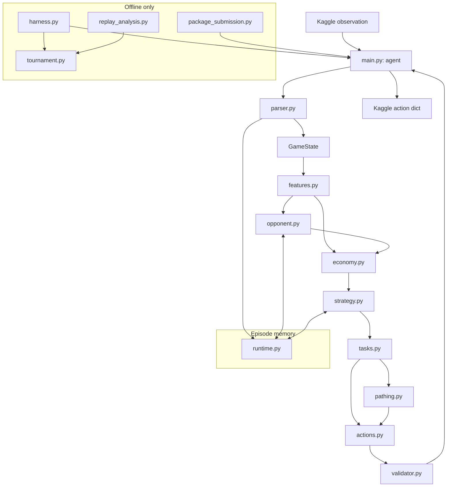

# TILLA_ARCHITECTURE.md

> **Audience:** AI coding agents first, human maintainer second.  
> **Status:** Source of truth for repository structure and implementation boundaries.  
> **Competition:** Kaggriculture (advanced environment), Kaggle.  
> **Last verified against upstream rules:** 2026-09-19.

If this file conflicts with an implementation convenience, this file wins. If this file conflicts with the official Kaggriculture environment, the official environment wins and this file must be corrected in the same change.

Read `TILLA_RULES.md` before changing game-mechanics code. Read `TILLA_STRATEGY.md` before changing decision policy.

---

## 1. Overview

This repository contains one competitive Kaggriculture agent, **Tilla**. Tilla receives the current 2-player farming simulation observation each turn and returns one farmer action, one action per hired hand, and up to 10 market orders. The goal is not to maximize farm value or yield in isolation; the goal is to finish the 720-turn season with more banked money than the opponent.

Tilla v1 is a **deterministic, stateful, market-aware economic planner**. It parses the observation, derives economic and opponent features, chooses a strategic plan, converts that plan into legal unit/market actions, and returns before Kaggle's 1-second action timeout.

### v1 scope

- Advanced `kaggriculture` environment only.
- Deterministic heuristic/economic planning.
- Lightweight stateful opponent modelling inside one episode.
- Market-aware crop, animal, land, labor, inventory, and liquidation decisions.
- Multi-unit task planning for farmer + hired hands.
- Local self-play/tournament evaluation.
- Replay analysis and submission packaging.
- Runtime code uses Python standard library only.

### Explicit non-goals

Do **not** build any of the following unless this document is deliberately revised after benchmark evidence:

- reinforcement learning;
- neural networks or model weights;
- LLM calls;
- remote APIs;
- a database;
- a web UI;
- a service backend;
- Redis, queues, workers, containers, or orchestration;
- distributed training;
- full Monte Carlo tree search;
- genetic/evolutionary optimization;
- pandas/NumPy/scikit-learn in the submitted runtime;
- strategy logic copied into `main.py`.

Tilla is a competition agent, not a product backend.

---

## 2. Fixed technical decisions

| Area | Decision | Reason |
|---|---|---|
| Runtime language | Python 3.11 syntax | Boring, well-supported, fast enough, and best-supported by Kaggle/AI coding agents. |
| Submission runtime deps | Python standard library only | Removes dependency/import risk in Kaggle execution. |
| Local environment | `kaggle-environments==1.30.2` initially | Current known release containing Kaggriculture; pin locally so benchmark behavior does not drift silently. |
| Tests | `pytest==9.*` | Mature, familiar, low-friction test runner. |
| Lint/format | `ruff==0.16.*` | One fast tool for linting/formatting; development-only. |
| Packaging | `tar.gz` with root `main.py` + `kaggriculture_bot/` package | Kaggle officially supports multi-file bundles and requires root `main.py`. |
| Persistence | None across games | Kaggle episodes are independent; runtime state is in-memory only. |
| State model | stdlib `dataclasses`, enums, typed aliases | No validation framework is justified for a fixed internal schema. |
| Pathfinding | deterministic shortest-path/BFS helpers | Board is 10×10; no external graph library needed. |
| Evaluation | seeded paired local matches | Strategy promotion must be empirical and reproducible. |
| Configuration | Python constants checked into source | No runtime secrets or environment configuration are required by Tilla. |

Do not add a dependency because it makes one implementation shorter. A new runtime dependency requires an explicit architecture change and benchmark evidence that stdlib is insufficient.

---

## 3. External contract

Official environment constraints currently used by this repository:

- 2 players;
- 10×10 default board;
- 24 turns/day × 30 days = 720 turns;
- `actTimeout = 1` second per action;
- starting money = 3000;
- max 10 market orders per turn;
- root submission file must expose `agent(obs)`;
- invalid game actions generally become silent no-ops, which means **Tilla's planner must validate before emitting** rather than relying on environment rejection.

The official upstream references are:

- `Kaggle/kaggle-environments/kaggle_environments/envs/kaggriculture/README.md`
- `Kaggle/kaggle-environments/kaggle_environments/envs/kaggriculture/AGENTS.md`
- `Kaggle/kaggle-environments/kaggle_environments/envs/kaggriculture/kaggriculture.py`
- `Kaggle/kaggle-environments/kaggle_environments/envs/kaggriculture/kaggriculture.json`

`TILLA_RULES.md` is our condensed local rule source. Never infer a game rule from strategy code.

---

## 4. System diagram



The online decision path must not import from `tools/`, `tests/`, or `benchmarks/`.

---

## 5. Runtime data model

There is no database. The expensive-to-change model is the typed in-memory representation of one observation and one episode's derived memory.

### Core value objects

`kaggriculture_bot/models.py` owns these types.

```text
Position
- x: int
- y: int

UnitState
- index: int              # 0 farmer, 1+ hired hands
- position: Position
- inventory: dict[str, int] | None

FarmState
- player_id: int
- money: int
- tiles: tuple[tuple[Tile, ...], ...]
- units: tuple[UnitState, ...]
- unlocked_quadrants: frozenset[str]
- hires_today: int

PrivateState
- shed: dict[str, int]
- seeds: dict[str, int]

MarketState
- inventory: dict[str, int]
- prices: dict[str, int]

TownState
- unlocked_shops: tuple[str, ...]

GameState
- step: int
- day: int
- hour: int
- player_id: int
- me: FarmState
- opponent: FarmState
- private: PrivateState
- market: MarketState
- town: TownState

EpisodeMemory
- player_id: int
- last_step: int
- previous_market_inventory: dict[str, int]
- opponent_history: bounded summaries only
- inferred_opponent_pipeline: dict[str, float]
- current_plan: StrategicPlan | None
- plan_created_step: int | None
```

### Constraints

- Money and all counts are integers.
- Never use floating point for actual bank balances, inventory quantities, or action affordability.
- Floating point is allowed only for **estimated scores/expected values**.
- `GameState` is treated as immutable after parsing.
- Raw Kaggle dictionaries must not leak into strategy modules.
- `EpisodeMemory` is reset when `obs["step"] == 0`.
- Runtime memory is keyed by `player_id` so local self-play with the same imported agent does not mix both players' histories.
- No unbounded history: retain summaries needed for inference, not every observation.
- `UnitState.inventory` is a dict only when that unit's carried inventory is observable. For opponent units it is `None` because opponent carried inventory is private. `None` means unobservable, not empty; no module may treat it as a known empty inventory.

### No hidden state assumptions

Only our own `private` state is visible. Opponent shed, seeds, and carried inventory are not observable. The typed state represents this directly: our units carry a real inventory dict, opponent units carry `inventory = None`. Opponent models must label estimates as estimates; strategy must not treat inferred private inventory as fact.

---

## 6. Repository structure

No new top-level directory may be added without changing this file.

```text
/
├── TILLA_ARCHITECTURE.md          # implementation source of truth
├── TILLA_RULES.md                 # game-mechanics source of truth
├── TILLA_STRATEGY.md              # current decision policy + promotion rules
├── README.md                # human setup/run/submit instructions
├── pyproject.toml           # dev tooling only; submitted runtime remains stdlib
├── main.py                  # Kaggle adapter only; exposes agent(obs)
│
├── kaggriculture_bot/
│   ├── __init__.py
│   ├── constants.py         # copied/derived stable game constants used by policy
│   ├── models.py            # typed internal state/action/value objects
│   ├── parser.py            # raw observation -> GameState only
│   ├── runtime.py           # bounded per-episode memory/reset
│   ├── features.py          # derived farm/market/season features
│   ├── economy.py           # ROI, cash runway, production/value estimates
│   ├── opponent.py          # public-state opponent inference
│   ├── strategy.py          # chooses strategic objectives, not paths
│   ├── tasks.py             # strategic objectives -> concrete unit jobs
│   ├── pathing.py           # movement/shortest-path primitives
│   ├── actions.py           # internal actions -> Kaggle action shape
│   └── validator.py         # last-line action legality/sanity checks
│
├── tools/
│   ├── harness.py           # run local matches
│   ├── tournament.py        # paired seeded candidate-vs-incumbent evaluation
│   ├── replay_analysis.py   # summarize losses/replays
│   └── package_submission.py# deterministic tar.gz packaging checks
│
├── agents/
│   ├── baseline.py          # stable simple baseline
│   └── incumbent.py         # frozen promoted champion snapshot/adapter
│
├── tests/
│   ├── fixtures/            # small hand-written observations
│   ├── test_parser.py
│   ├── test_economy.py
│   ├── test_opponent.py
│   ├── test_strategy.py
│   ├── test_tasks.py
│   ├── test_actions.py
│   ├── test_runtime.py
│   └── test_submission.py
│
└── benchmarks/
    ├── scenarios.json       # named deterministic scenario definitions
    └── results/             # ignored generated reports; never imported by runtime
```

### What does not belong where

- `main.py`: no strategy, ROI math, pathfinding, or game constants.
- `parser.py`: no decisions; parsing only.
- `economy.py`: no unit movement or action formatting.
- `opponent.py`: no direct actions; produces estimates/features.
- `strategy.py`: no BFS/pathfinding and no raw observation access.
- `tasks.py`: no market price formulas; consumes scored objectives.
- `tools/`: never imported by submitted runtime.
- `tests/`: never used as runtime configuration.

---

## 7. Dependency direction and boundaries

Allowed runtime dependency flow:

```text
constants/models
      ↑
parser/runtime
      ↑
features/opponent/economy
      ↑
strategy
      ↑
tasks/pathing
      ↑
actions/validator
      ↑
main
```

Modules may depend sideways only where explicitly noted:

- `economy` may consume opponent estimates.
- `tasks` may call `pathing`.
- `validator` may read constants/models.

Forbidden:

- lower layers importing `strategy`;
- `parser` importing `economy`;
- `economy` importing `tasks`;
- any runtime module importing from `tools`, `tests`, or `benchmarks`.

---

## 8. Tilla call flow

`main.py` must stay boring:

1. receive raw `obs`;
2. reset/get `EpisodeMemory`;
3. call `parse_observation`;
4. derive features;
5. update opponent model;
6. compute economic scores;
7. choose/update `StrategicPlan`;
8. allocate concrete tasks to units;
9. format market + unit actions;
10. validate/sanitize;
11. return the Kaggle action dict.

If an unexpected exception reaches `main.py`, catch it at the outer boundary and return a structurally valid PASS action. Tests must make this path rare; it is a competition survival fallback, not normal control flow.

### Time budget

Kaggle allows 1 second. Our design target is:

- median decision time: `< 20 ms`;
- p99 local decision time: `< 100 ms`;
- hard local warning: `>= 200 ms`.

Do not consume the full external timeout. Any future look-ahead/search feature gets an internal time budget and must degrade to the deterministic planner.

---

## 9. Key flow: normal turn

```text
obs
→ parser.parse_observation
→ features.derive_features
→ opponent.update_model
→ economy.score_opportunities
→ strategy.choose_plan
→ tasks.assign_jobs
→ actions.build_action
→ validator.validate_or_fallback
→ dict returned
```

`StrategicPlan` may persist across turns, but strategy must re-evaluate when one of these happens:

- day changes;
- plan objective completes or becomes impossible;
- market price crosses a configured decision threshold;
- opponent pipeline materially changes;
- cash falls below reserve;
- phase changes;
- endgame liquidation window starts.

Do not recompute expensive global planning merely because another turn occurred.

---

## 10. Key flow: local candidate evaluation

```text
candidate code
→ unit tests
→ deterministic scenario tests
→ candidate vs built-in starter/random
→ paired seeded candidate vs incumbent
→ aggregate report
→ promotion gate
→ freeze incumbent only if gate passes
```

Primary promotion metric: **paired win rate against incumbent**.

Secondary metric: **median terminal cash margin**.

Hard guardrails:

- 0 crashes;
- 0 invalid output shapes;
- 0 action timeouts;
- no material regression in mandatory scenario suite.

Default promotion gate until `TILLA_STRATEGY.md` changes it:

- at least 2,000 paired games across controlled seeds and seat swaps;
- candidate win rate `> 53%`;
- lower 95% Wilson confidence bound `> 50%`;
- median terminal cash margin `> 0`.

Do not promote based on average cash alone.

---

## 11. Key flow: submission

1. tests and lint pass;
2. run tournament against frozen incumbent;
3. promote only through the defined gate;
4. package `main.py` + `kaggriculture_bot/`;
5. verify tar root contains `main.py`;
6. extract package into a temp directory;
7. import `main.agent`;
8. run self-validation match and baseline match;
9. measure action timings;
10. record git commit + benchmark summary in submission message/log.

Never package:

- `.env`;
- Kaggle credentials;
- caches;
- tests;
- replays;
- benchmark result files;
- local virtualenvs.

---

## 12. Action contract

Internal code should use typed action objects; only `actions.py` emits Kaggle lists.

Final shape:

```json
{
  "farmer": ["PASS"],
  "hands": [],
  "market": []
}
```

Rules:

- exactly one farmer action;
- one hand action per currently hired hand, in hand order;
- market list length `<= 10`;
- never intentionally emit a known illegal action;
- market order priority is explicit and deterministic;
- if planned market orders exceed 10, trim by priority in our code; never rely on Kaggle silently dropping extras.

`validator.py` is the final safety net. It may downgrade an invalid planned action to `PASS`; it must not invent strategy.

---

## 13. Strategic state and opponent memory

Tilla is stateful only within an episode.

Opponent modelling is deterministic and based only on public observations:

- public planted crop counts and ages;
- public animal/structure counts;
- unlocked land;
- hired hands;
- bank balance;
- visible harvestable yield on tiles;
- market inventory deltas;
- timing of visible farm transitions.

The model may estimate likely future supply per product, but estimates must carry confidence. Low-confidence estimates should adjust opportunity scores mildly, not trigger irreversible all-in decisions.

Do not attempt identity-level modelling across Kaggle opponents or episodes.

---

## 14. Cross-cutting conventions

### Naming

- modules/functions/variables: `snake_case`;
- classes/enums: `PascalCase`;
- constants: `UPPER_SNAKE_CASE`;
- functions that estimate rather than observe start with `estimate_` where ambiguity matters.

### Determinism

Given the same observation + `EpisodeMemory`, Tilla must return the same action.

Do not use unseeded randomness in runtime strategy.

### Game time

Use:

- `step` for turn-level timing;
- `day` for daily care/phase logic;
- `hour` only for within-day scheduling.

Never use wall-clock time for strategy.

### Money

- real money/state values: integer coins;
- estimated economics: float allowed;
- affordability checks: integers only.

### Logging

Submission runtime should not spam stdout.

Development logging is off by default. If enabled locally, log structured summaries at day boundaries or explicit diagnostic points, not every feature every turn.

### Configuration

Strategy constants live in `constants.py` only when they are implementation parameters. The meaning/rationale of strategic thresholds belongs in `TILLA_STRATEGY.md`.

No `.env` is required.

---

## 15. Security and competition-safety baseline

This is not a network service, so conventional web auth/security sections do not apply.

Still enforce:

- never commit Kaggle API tokens;
- no network calls from Tilla;
- no filesystem writes required by `agent`;
- no dynamic code execution;
- no subprocesses in runtime;
- no reading opponent private state through local harness shortcuts;
- evaluate only observations Kaggle legitimately supplies;
- package only our source and permitted files.

A local evaluator must not expose hidden environment state to strategy code. Test harness convenience must never create a capability Tilla cannot have in submission.

---

## 16. Testing policy

Tests exist mainly to catch an AI agent changing something unrelated.

### Unit tests

Required for:

- parser normalization;
- crop/animal ROI calculations;
- market opportunity calculations;
- phase/endgame transitions;
- opponent pipeline inference;
- pathing;
- task assignment;
- market order trimming;
- runtime reset;
- action schema validation.

### Rule conformance tests

For important mechanics duplicated as constants or calculations, write tests against the installed Kaggriculture environment where practical. Examples:

- land costs;
- hire Fibonacci cost;
- action limit;
- crop production timing;
- town demand schedule assumptions.

This catches upstream/environment drift.

### Scenario tests

Hand-written situations must cover at least:

- fresh planting needing same-day water;
- emergency watering/feed before economic expansion;
- shed near capacity;
- premium-product glut;
- high-scarcity sell opportunity;
- partial farm expansion decision;
- opponent impending harvest;
- day 27+ liquidation;
- final-day no long-horizon investment;
- missing/odd observation field fallback.

### Integration tests

Run complete episodes against:

- `"pass"`;
- `"random"`;
- `"starter"`;
- our frozen baseline/incumbent.

A change that passes unit tests but crashes a full episode is not mergeable.

---

## 17. Local development and benchmark environment

Local setup:

```bash
python3.11 -m venv .venv
source .venv/bin/activate
pip install -e ".[dev]"
pytest
ruff check .
ruff format --check .
```

`pyproject.toml` may declare development dependencies, but runtime modules must remain importable with stdlib alone.

For benchmark reproducibility, pin `kaggle-environments`. Do not casually upgrade it. An environment upgrade requires:

1. read upstream Kaggriculture diffs;
2. update `TILLA_RULES.md` if mechanics changed;
3. run rule-conformance tests;
4. rerun incumbent benchmark suite before evaluating new strategy changes.

---

## 18. Rules for AI coding agents

These are hard rules.

1. Read `TILLA_ARCHITECTURE.md`, `TILLA_RULES.md`, and `TILLA_STRATEGY.md` before implementing strategy or mechanics.
2. Do not add runtime dependencies.
3. Do not add top-level directories without updating this file.
4. Do not put decision logic in `main.py`, `parser.py`, or `actions.py`.
5. Do not change a game rule because a heuristic would be easier to implement another way.
6. Do not duplicate an official game constant in multiple modules.
7. Do not infer opponent private inventory as fact.
8. Do not add randomness to runtime policy unless `TILLA_STRATEGY.md` explicitly authorizes it.
9. Do not modify the incumbent agent as part of testing a candidate. The incumbent is frozen comparison code.
10. Do not promote a strategy because it “looks better”; run the promotion benchmark.
11. Every behavior change needs a focused test or benchmark scenario.
12. Every change must leave `main.agent` runnable in the official local environment.
13. No strategy work may depend on hidden harness state unavailable in Kaggle observations.
14. Update this file in the same commit whenever an architectural decision changes.
15. Update `TILLA_RULES.md` only for verified game-mechanics changes; update `TILLA_STRATEGY.md` for policy changes.
16. Prefer modifying an existing module over inventing a new abstraction.
17. If unsure where code belongs, follow the dependency direction in §7; do not create a convenience layer.
18. Before finishing a milestone: run tests, lint, at least one full episode, and `git diff --check`.

---

## 19. Decision log

### D-001 — Deterministic planner before learning systems
**Context:** Short competition window, explicit rules, 1-second action timeout.  
**Decision:** Build a deterministic economic planner first.  
**Rejected:** RL/neural policy, LLM policy. They add training/runtime uncertainty before we have a strong baseline.

### D-002 — Standard library submission runtime
**Context:** Kaggle runtime reliability matters more than convenience.  
**Decision:** No third-party imports in submitted runtime.  
**Rejected:** NumPy/Pandas/scikit-learn. None is required for a 10×10 state and simple arithmetic.

### D-003 — Stateful opponent model
**Context:** Opponent farm is public and future supply affects shared prices.  
**Decision:** Maintain bounded episode memory and infer production pipeline.  
**Rejected:** purely reactive current-turn strategy; it throws away useful temporal information.

### D-004 — No persistent/indexed game store
**Context:** Each episode is only 720 turns and no cross-game state is legal/needed.  
**Decision:** in-memory episode state only.  
**Rejected:** SQLite/Postgres/files.

### D-005 — Paired win rate is the promotion metric
**Context:** Competition objective is head-to-head terminal cash.  
**Decision:** seat-swapped paired matches against frozen incumbent determine promotion.  
**Rejected:** average bankroll against weak baselines as primary metric.

### D-006 — Multi-file tar submission
**Context:** One-file agents become difficult for AI agents to edit safely. Kaggle supports tar bundles.  
**Decision:** keep modular package plus root adapter.  
**Rejected:** monolithic `main.py`.

### D-007 — Search is optional optimization, not baseline architecture
**Context:** shallow look-ahead may help capital allocation but can threaten timing and complexity.  
**Decision:** first implement deterministic scoring; add bounded search only if benchmark evidence shows benefit.  
**Rejected:** planning tree as initial core.

---

## 20. Build order

Each milestone must end with a runnable `main.agent`.

### Milestone 0 — Repository contract
- Add these three source-of-truth docs.
- Add `pyproject.toml`, package skeleton, tests skeleton.
- `main.agent` returns valid PASS action.
- Add packaging smoke test.

**Done when:** official environment runs a full 720-turn PASS-vs-PASS episode from our `main.py`.

### Milestone 1 — State and legality slice
- `models.py`, `parser.py`, `runtime.py`.
- Parse every current official observation field.
- `actions.py` + `validator.py`.
- Rule-conformance fixtures.

**Done when:** arbitrary official observations parse and a structurally legal action is always returned.

### Milestone 2 — Movement and farm-care baseline
- pathing;
- watering/feed emergency priorities;
- planting/harvest basic loop;
- simple seed purchases;
- baseline agent snapshot.

**Done when:** Tilla completes full matches with zero invalid shapes/timeouts and beats PASS reliably.

### Milestone 3 — Economic model
- crop/animal return estimates;
- cash reserve;
- land/labor opportunity cost;
- sell/hold logic;
- shed-capacity awareness.

**Done when:** scenario tests prove sensible ranking and candidate beats Milestone 2 baseline.

### Milestone 4 — Multi-unit task planner
- daily hand hiring policy interface;
- job generation;
- unit assignment;
- movement-to-task persistence;
- conflict avoidance.

**Done when:** extra hands create measurable value and do not starve care tasks.

### Milestone 5 — Market and town model
- expected town demand;
- scarcity/glut scoring;
- sell timing;
- premium-product glut protection.

**Done when:** market-aware candidate beats incumbent through promotion gate or the change is reverted.

### Milestone 6 — Opponent model
- visible pipeline inference;
- likely harvest windows;
- market-pressure adjustment;
- confidence-weighted influence.

**Done when:** opponent-aware candidate passes promotion gate against diverse incumbent/baseline mix.

### Milestone 7 — Phase/endgame policy
- compounding/scaling/harvesting/liquidation phases;
- no long-payback investments late;
- final inventory liquidation;
- terminal bank optimization.

**Done when:** endgame scenarios pass and terminal-cash metrics improve without win-rate regression.

### Milestone 8 — Tournament/replay loop
- 2,000+ paired game runner;
- Wilson interval;
- seat swaps;
- replay summaries;
- incumbent promotion command/process.

**Done when:** one command produces a promotion report with crashes, timings, win rate, CI, and cash margin.

### Milestone 9 — Optional bounded look-ahead
Only start if loss analysis identifies specific high-value decisions that heuristic scoring cannot resolve.

**Done when:** feature fits internal time budget and independently passes the promotion gate. Otherwise remove it.

### Milestone 10 — Submission hardening
- deterministic tar packaging;
- clean extraction/import test;
- self-match validation;
- baseline match;
- timing benchmark;
- submission checklist.

**Done when:** exact packaged artifact passes all checks and is ready for Kaggle CLI submission.

---

## 21. Assumptions and open questions

### Locked assumptions

- Use the advanced `kaggriculture` competition, not beginner.
- Use all official default configuration values unless Kaggle's competition runtime overrides them.
- Runtime policy is deterministic.
- Runtime dependencies are stdlib only.
- Opponent modelling is stateful within an episode.
- Online strategy does not use hidden environment state.
- Candidate promotion uses paired win rate first.

### Open questions

These do not block Milestones 0–4:

1. Whether Kaggle's production competition pins exactly the same environment revision as current `kaggle-environments` master/PyPI. We handle this with conformance tests and replay evidence.
2. Exact strategic thresholds (cash reserve, land ROI margin, product hold/sell thresholds). These belong in `TILLA_STRATEGY.md` and should be tuned by benchmarks rather than architecture changes.
3. Whether bounded forward simulation materially improves win rate enough to justify runtime complexity. Default is no until proven.
